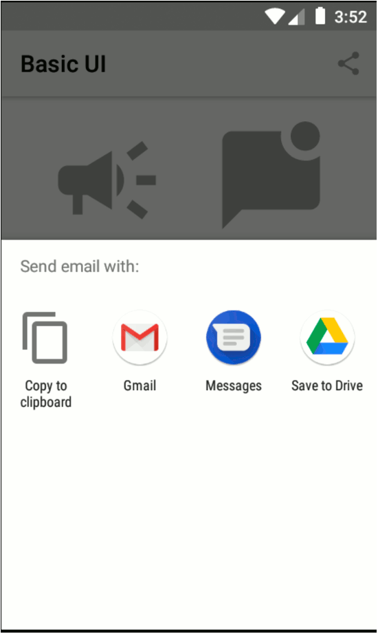

[](http://kotlinlang.org)


# Basic UI

<p align="center">
  
</p>

A Basic UI in _Android_ with _kotlin_.



This is a showcase of simple UI elements like **toast** and **alert**, using [Splitties](https://github.com/LouisCAD/Splitties).
Also this project implements **sending email**, **sharing content**, **opening a web page**
using _Android SDK_ and extension function with _Kotlin_.
It was created from `Basic Activity` template from _Android Studio_.

<!-- TABLE OF CONTENTS -->
<details close>
  <summary>Table of Contents</summary>
  <ul>
    <li>
      <a href="#getting-started">Getting Started</a>
      <ul>
        <li><a href="#prerequisites">Prerequisites</a></li>
        <li><a href="#installation">Installation</a></li>
      </ul>
    </li>
    <li><a href="#dependencies">Dependencies</a></li>
    <li><a href="#usage">Usage</a></li>
    <li><a href="#roadmap">Roadmap</a></li>
    <li><a href="#contributing">Contributing</a></li>
    <li><a href="#naming-convention">Naming convention</a></li>
    <li><a href="#license">License</a></li>
    <li><a href="#related-blog-posts-in-fr">Related blog posts in FR</a></li>
    <li><a href="#contact">Contact</a></li>
  </ul>
</details>

## Getting Started

This is an _Android_ project made with _Kotlin_ language.

### Prerequisites

Install [Android Studio](https://developer.android.com/studio), see instructions
on [ChillCoding.com](https://www.chillcoding.com/blog/2016/08/03/android-studio-installation/),
in FR.

### Installation

1. Clone the repo
   ```sh
   git clone https://github.com/machadaCosta/basic-ui.git
   ```
2. Choose, _Open an Existing Project_ in _Android Studio_

## Dependencies

### Libraries
  * [Splitties: All the Android splits](https://github.com/LouisCAD/Splitties)

### Other
  * [View Binding, Part of Android Jetpack](https://developer.android.com/topic/libraries/view-binding)

## Usage

Use this space to show beautiful User Interface elements.

## Roadmap

See the [open issues](https://github.com/machadaCosta/basic-ui/issues) for a list of proposed features (and known issues).

## Contributing

Contributions are what make the open source community such an amazing place to be learn, inspire, and create. Any contributions you make are **greatly appreciated**.

1. Fork the Project
2. Create your Feature Branch (`git checkout -b feature/AmazingFeature`)
3. Commit your Changes (`git commit -m 'Add some AmazingFeature'`)
4. Push to the Branch (`git push origin feature/AmazingFeature`)
5. Open a Pull Request

## Naming convention

See naming convention of [Kotlin for Android project](https://gitlab.com/chillcoding-at-the-beach/kotlin-for-android/-/wikis/Naming-Convention).

## License

Distributed under the GNU General Public License v3.0. See [LICENSE](https://github.com/machadaCosta/basic-ui/blob/main/LICENSE) for more information (cf. [Choose an open source license](https://choosealicense.com/)).

## Related blog posts in FR

 * [Utiliser des bibliothèques graphiques Kotlin dans un projet Android \[AK 4 D\]](https://www.chillcoding.com/blog/2017/10/09/utiliser-bibliotheque-graphique-kotlin-android/)

 Autres articles :
 * [Installer un environnement de développement Android \[AK 1\]](https://www.chillcoding.com/blog/2016/08/03/android-studio-installation/)
 * [Comprendre la configuration d'un projet Android Studio \[AK 2\]](https://www.chillcoding.com/blog/2017/09/28/configurer-kotlin-projet-android/)
 * [Dessiner un coeur dans une vue en Kotlin avec Android \[AK 2\]](https://www.chillcoding.com/android-custom-view-heart/)
 * [Initialiser un tableau en Kotlin \[AK 2 \]](https://www.chillcoding.com/blog/2019/09/26/kotlin-array/)
 * [Android References \[AK 3 D\]](https://www.chillcoding.com/blog/2017/01/27/android-references/)
 * [Top 6 des raccourcis dans Android Studio (AK 3)](https://www.chillcoding.com/blog/2016/04/01/android-top-raccourcis/)
 * [Accéder facilement aux éléments d'une vue Android \[AK 4 A\]](https://www.chillcoding.com/blog/2017/10/03/utiliser-extensions-kotlin/)
 * [UI Cheatsheet (AK 4 B)](https://www.chillcoding.com/blog/2017/01/16/android-ui-cheatsheet/)
 * [Afficher une liste d'éléments avec un RecyclerView \[AK 6\]](https://www.chillcoding.com/blog/2018/10/22/creer-liste-recyclerview-kotlin-android/)
 * [Utiliser le fichier de Préférences \[AK 7\]](https://www.chillcoding.com/blog/2014/10/10/utiliser-fichier-preferences/)
 * [Créer une base de données locale avec Anko SQLite \[AK 8\]](https://www.chillcoding.com/blog/2018/01/17/creer-bdd-sqlite-kotlin-android/)
 * [Faire une requête HTTP GET avec Retrofit en Kotlin Android (AK 9)](https://www.chillcoding.com/blog/2017/03/14/requete-http-get-retrofit-android/)
 * [L'extraordinaire Humanoïde !](https://www.chillcoding.com/blog/2014/08/08/extraordinaire-humanoide/)
 * [Introduction à Kotlin](https://www.chillcoding.com/blog/2017/07/11/android-kotlin-introduction/)
 * [Déployer une app. Android Wear sur une smartwatch](https://www.chillcoding.com/blog/2016/06/14/android-wear-configuration/)

## Contact [![LinkedIn][linkedin-shield]][linkedin-url]

Macha DA COSTA, on [ChillCoding](https://www.chillcoding.com/?#about).

[linkedin-shield]: https://img.shields.io/badge/-LinkedIn-black.svg?style=for-the-badge&logo=linkedin&colorB=555
[linkedin-url]: https://www.linkedin.com/in/MachaDaCosta/
